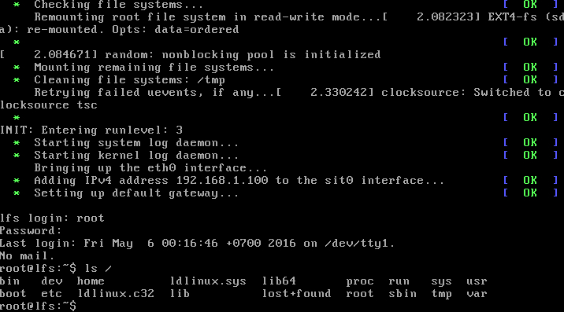

# linux from scratch automated build
- automated build linux from scratch in docker environemnt
- allow developer can test imediately linux distribution in virtual machine
- new style of linux distribution

# screen



# requirements

- linux from scratch version 7.8
- docker version 1.10.3
- docker image debian:jessie
- operating system: debian
- disk space ~32GB

# news

- 2016-05-04: active ghost distribution
- 2016-05-05: active live distribution
- **2016-05-06: prepare to next version, detach from linux from scratch**

# general architecture

    |----------------------------------------------------------------------|
    | linux from scratch                                                   |
    |----------------------------------------------------------------------|
    | docker container                                                     |
    |----------------------------------------------------------------------|
    | host operating system                                                |
    |----------------------------------------------------------------------|

    - host operating system: provide environment to run docker and virtual
      storage, where store linux from scratch

    - docker container: provide environment to build linux from scratch. it is
      use to reduce damage and unnecessary tools to host operating system

    - linux from scratch: contains instructions to build linux from scratch,
      write in shell script

# documentations

see [doc directory](./doc)

# instructions

**warning**:
- approximate build time about 6 hours. process run full test for both
temporary tools and system
- no installer present, if you want install to storage target, do it by hand.
installer will present in next version
- user name/password to login: root/root

**result in ./disk/lfs-disk.img when mount to /mnt/lfs**
- ghost distribution file: ./dist/dest/lfs.ghost.amd64.iso
- live distribution file: ./dist/dest/lfs-live.amd64.iso

**commands**
- run automated setup with ghost distribution

```shell
# setup
./run.sh --dist=ghost

# try in virtual machine
./vm.active ghost
```
- run automated setup with live distribution

```shell
# setup
./run.sh --dist=live

# try in virtual machine
./vm.active live
```

- enter box environment under dev user

```shell
./run.sh box
```

- enter tmp-sys environment under root user

```shell
./run.sh tmp-sys
```

- enter sys environment under root user

```shell
./run.sh sys
```
